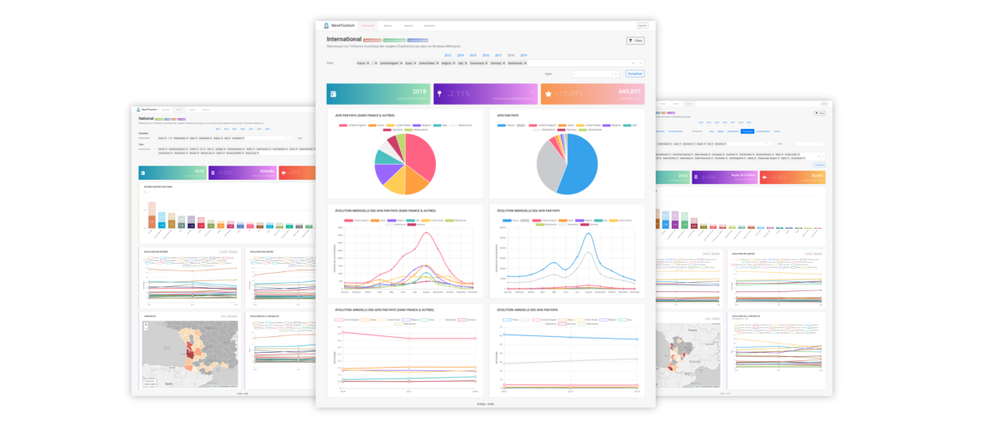

# Tourism API

Micro-service of the Neo4Tourism framework which hierarchy implicitly manages the request parameters in order to define the required study (target Neo4j database), the granularity of the request (cities, departments, regions, countries) and the study parameters (population, traffic, evolution, centrality). It also makes it possible to manage database security and query consistency based on the corresponding studies.

<p align="center">

</p>

<p align="center">
  <a href="https://bm.dvrc.fr/">Demo</a> | 
  <a href="https://quelhasu.github.io/tourism-api/">Documentation</a> | 
  <a href="https://github.com/quelhasu/tourism-admin">Tourism Admin Dashboard</a> |
  <a href="https://github.com/quelhasu/tourism-dashboard">Tourism Dashboard</a>
</p>

## Installation

```bash
$ git clone https://github.com/quelhasu/tourism-dashboard
```

To connect to the Neo4j database, add the `.env` file in the root of the project with this configuration according your parameters:

```js
DATABASE_USERNAME = "username";
DATABASE_PASSWORD = "password";
```

You can then choose to launch the service in two different ways:

### Development

The local configuration for the REST service is in the file `neo4j/dbUtils.js`, the driver must then launch the local configuration present in the file `config.js` in the root of the project like this:

```js
nconf.get('neo4j-local').
```

If the database is not available locally but externally, you can modify the `config.js` file to add your own link. Then you can run the service:

```bash
$ cd tourism-dashboard
$ npm i
$ npm run dev
```

### Docker

Run the dockerfile independently or you can also include it in `docker-compose.yml` file.

```bash
$ cd tourism-dashboard
$ docker build -t tourism-dashboard .
...
$ docker run -d -p 3000:3000 tourism-api
```

If you want to use it in docker-compose file, same as above but with `neo4j-docker` variable to access the neo4j container. Here is an example of `docker-compose.yml` including the neo4j database and the rest service:

```yml
version: "3"
services:
  api:
    container_name: api
    build:
      context: ./tourism-api
      dockerfile: Dockerfile
    ports:
      - "3000:3000"
    links:
      - neo4j
    depends_on:
      - neo4j
    environment:
      WAIT_HOSTS: neo4j:7474
      WAIT_HOSTS_TIMEOUT: 60
  neo4j:
    container_name: database
    image: neo4j:latest
    ports:
      - "7473:7473"
      - "7474:7474"
      - "7687:7687"
    expose:
      - "7473"
      - "7474"
      - "7687"
    environment:
      - NEO4J_dbms_security_procedures_unrestricted=algo.*,apoc.*
      - NEO4J_apoc_export_file_enabled=true
      - NEO4J_apoc_import_file_use__neo4j__config=true
      - NEO4J_apoc_import_file_enabled=true
      - NEO4J_dbms_shell_enabled=true
      - NEO4J_dbms_memory_heap_max__size=8G
      - NEO4J_dbms_memory_heap_initial__size=8G
    volumes:
      - $HOME/neo4tourism/tourism-neo4j/plugins:/plugins
      - $HOME/neo4tourism/tourism-neo4j/data:/data
      - $HOME/neo4tourism/tourism-neo4j/import:/import
```

## Add new routes

All routes are available in the `routes` folder. It's possible to add as many routes as desired, it's then necessary to modify the `app.js` file in order to make them accessible.  
The architecture implies that interactions with the database are performed in the files of the `models` folder.

## Add new context

To add a new context, modify the `config/config.json` file by adding the name of the city being studied. For example, if you have a database based on the city of _Paris_ with an API call that may look like `https://api.com/paris/destination`, add the following object:

```json
{
  "paris": {
    // city name called in the API URL
    "bolt": "bolt://", // bolt url of the Neo4j database
    "name_0": "France", // country
    "name_1": "Provence-Alpes-Côte d’Azur", // region
    "name_2": "Bouches-du-Rhône", // department
    "name_3": "Marseille"
  }
}
```
