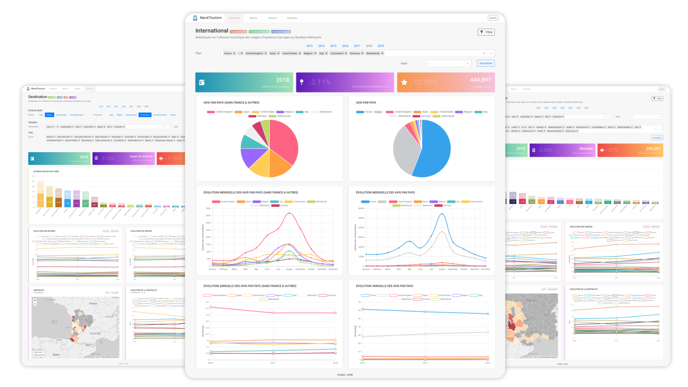

# Tourism API

Micro-service of the Neo4Tourism framework which hierarchy implicitly manages the request parameters in order to define the required study (target Neo4j database), the granularity of the request (cities, departments, regions, countries) and the study parameters (population, traffic, evolution, centrality). It also makes it possible to manage database security and query consistency based on the corresponding studies.

<p align="center">

</p>

<p align="center">
  <a href="https://bm.dvrc.fr/">Demo</a> | 
  <a href="https://quelhasu.github.io/tourism-api/">Documentation</a> | 
  <a href="https://github.com/quelhasu/tourism-admin">Tourism Admin Dashboard</a> |
  <a href="https://github.com/quelhasu/tourism-dashboard">Tourism Dashboard</a>
</p>

## Installation

```bash
$ git clone https://github.com/quelhasu/tourism-dashboard
```

To connect to the Neo4j database, add the `.env` file in the root of the project with this configuration according your parameters:

```js
DATABASE_USERNAME = "username"
DATABASE_PASSWORD = "password"
```

You can then choose to launch the service in two different ways:

### Development

The local configuration for the REST service is in the file `neo4j/dbUtils.js`.
You can modify the `config/config.json` file to add your own link. 
```json
{
  "BM":{
    "bolt": "bolt://172.23.0.2"
  }
}
```
Then you can run the service:

```bash
$ cd tourism-api
$ npm i
$ npm run dev
```

### Docker

If you want to run it with Docker, make sure you have already instantiated the Neo4j database container, you can find an explanation [here](README_db.md).

It will then be necessary to modify the configuration file to access the correct database according to the IP address it has allocated.

You can then launch the container from the docker-compos command which will allocate an IP address for the API in the network previously created in Docker.
```bash
$ docker-compose build
$ docker-compose up
```
Then your API is accessible on port 3000 according the yaml file.

## Add new routes

All routes are available in the `routes` folder. It's possible to add as many routes as desired, it's then necessary to modify the `app.js` file in order to make them accessible.  
The architecture implies that interactions with the database are performed in the files of the `models` folder.

## Add new context

To add a new context, modify the `config/config.json` file by adding the name of the city being studied. For example, if you have a database based on the city of __Marseille__ with an API call that may look like `https://api.com/marseille/destination`, add the following object:

```json
{
  "marseille": {
    // city name called in the API URL
    "bolt": "bolt://", // bolt url of the Neo4j database
    "name_0": "France", // country
    "name_1": "Provence-Alpes-Côte d’Azur", // region
    "name_2": "Bouches-du-Rhône", // department
    "name_3": "Marseille"
  }
}
```
